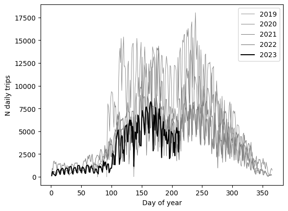

+++
title = "Utforskning av bysykkeldata"
Summary = "Et prosjekt i å undersøke åpne data fra bysykkel i Oslo. Målet er få et estimat på"
+++


```python
# Init
import pandas as pd
from sqlite3 import connect
import matplotlib.pyplot as plt
from datetime import date
```


```python
# load data

with connect("../data/trips.db") as con:
    trips_data_head = pd.read_sql_query(
        """
        SELECT * FROM trips LIMIT 5;
        """, con)

bysykkel_data_head

```


<div>
<table border="1" class="dataframe">
  <thead>
    <tr style="text-align: right;">
      <th></th>
      <th>started_at</th>
      <th>ended_at</th>
      <th>duration</th>
      <th>start_station_id</th>
      <th>end_station_id</th>
    </tr>
  </thead>
  <tbody>
    <tr>
      <th>0</th>
      <td>2019-04-02 22:18:47.926000+00:00</td>
      <td>2019-04-02 22:24:25.427000+00:00</td>
      <td>337</td>
      <td>401</td>
      <td>381</td>
    </tr>
    <tr>
      <th>1</th>
      <td>2019-04-02 22:25:54.203000+00:00</td>
      <td>2019-04-02 22:27:36.114000+00:00</td>
      <td>101</td>
      <td>556</td>
      <td>556</td>
    </tr>
    <tr>
      <th>2</th>
      <td>2019-04-02 22:26:39.308000+00:00</td>
      <td>2019-04-02 22:31:59.445000+00:00</td>
      <td>320</td>
      <td>561</td>
      <td>471</td>
    </tr>
    <tr>
      <th>3</th>
      <td>2019-04-03 03:09:58.992000+00:00</td>
      <td>2019-04-03 03:12:00.589000+00:00</td>
      <td>121</td>
      <td>393</td>
      <td>393</td>
    </tr>
    <tr>
      <th>4</th>
      <td>2019-04-03 03:10:02.415000+00:00</td>
      <td>2019-04-03 03:14:44.537000+00:00</td>
      <td>282</td>
      <td>597</td>
      <td>557</td>
    </tr>
    <tr>
      <th>5</th>
      <td>2019-04-03 03:16:21.557000+00:00</td>
      <td>2019-04-03 03:27:20.124000+00:00</td>
      <td>658</td>
      <td>471</td>
      <td>412</td>
    </tr>
    <tr>
      <th>6</th>
      <td>2019-04-03 03:39:11.948000+00:00</td>
      <td>2019-04-03 03:42:46.377000+00:00</td>
      <td>214</td>
      <td>598</td>
      <td>401</td>
    </tr>
    <tr>
      <th>7</th>
      <td>2019-04-03 03:43:38.513000+00:00</td>
      <td>2019-04-03 03:50:02.914000+00:00</td>
      <td>384</td>
      <td>462</td>
      <td>613</td>
    </tr>
    <tr>
      <th>8</th>
      <td>2019-04-03 03:46:23.126000+00:00</td>
      <td>2019-04-03 04:00:40.509000+00:00</td>
      <td>857</td>
      <td>461</td>
      <td>385</td>
    </tr>
    <tr>
      <th>9</th>
      <td>2019-04-03 03:50:36.147000+00:00</td>
      <td>2019-04-03 03:56:15.344000+00:00</td>
      <td>339</td>
      <td>463</td>
      <td>448</td>
    </tr>
  </tbody>
</table>
</div>


```python
# load stations
with connect("../data/trips.db") as con:
    stations_data_head = pd.read_sql_query(
        """
        SELECT * FROM stations LIMIT 5;
        """, con)

stations_data_head
```


<table border="1" class="dataframe">
  <thead>
    <tr style="text-align: right;">
      <th></th>
      <th>id</th>
      <th>latitude</th>
      <th>longitude</th>
    </tr>
  </thead>
  <tbody>
    <tr>
      <th>0</th>
      <td>377</td>
      <td>59.915667</td>
      <td>10.7775665</td>
    </tr>
    <tr>
      <th>1</th>
      <td>378</td>
      <td>59.9298480014783</td>
      <td>10.7113998636029</td>
    </tr>
    <tr>
      <th>2</th>
      <td>380</td>
      <td>59.93923</td>
      <td>10.75917</td>
    </tr>
    <tr>
      <th>3</th>
      <td>381</td>
      <td>59.91252</td>
      <td>10.76224</td>
    </tr>
    <tr>
      <th>4</th>
      <td>382</td>
      <td>59.92960980877</td>
      <td>10.732839</td>
    </tr>
  </tbody>
</table>


## Nøkkeltall

Dataene strekker seg fra april 2019 til og med juni 2023. 


```python
# Plot antall turer

with connect("../data/trips.db") as con:
    daily_trips = pd.read_sql_query(
        """
        SELECT strftime('%Y-%m-%d', started_at) AS started_date, 
        count(*) AS n_trips
        FROM trips
        GROUP BY strftime('%Y-%m-%d', started_at);
        """, con, parse_dates=["started_date"])


```


```python
fig, ax = plt.subplots()

*trips_by_year, this_year = daily_trips.groupby(daily_trips["started_date"].dt.year)

for year, data in trips_by_year:
    data.set_index(data["started_date"].dt.day_of_year, inplace=True)
    data["n_trips"].plot(ax=ax, label=year, color=f"grey",linewidth=0.6 + (year - 2019) / 10)

year, data = this_year
data.set_index(data["started_date"].dt.day_of_year, inplace=True)
data["n_trips"].plot(ax=ax, label=year, color="black")
ax.set_xlabel("Day of year")
ax.set_ylabel("N daily trips")
plt.legend()
plt.show()
```


    

Den blir oppdatert?

